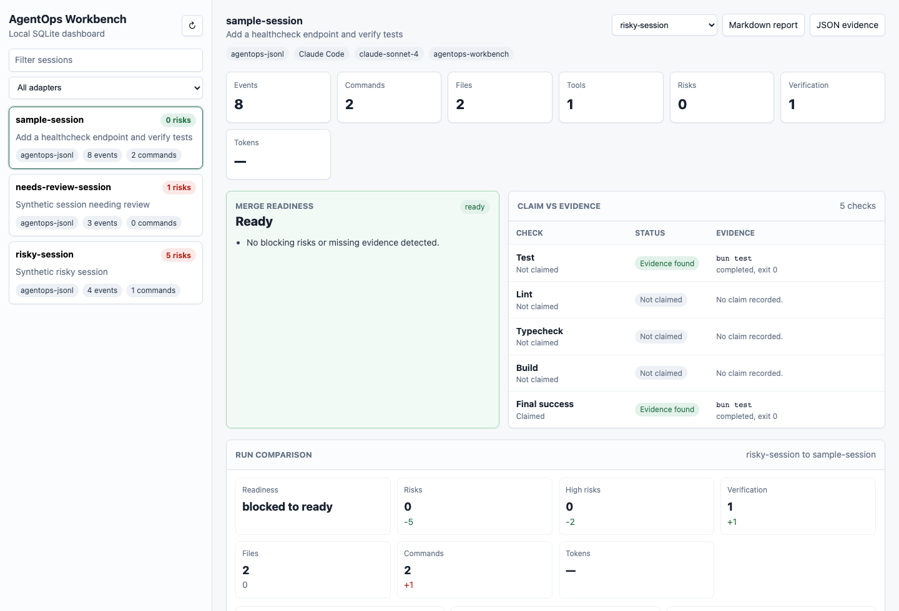

# AgentOps Workbench

[](https://github.com/DevenDucommun/agentops-workbench/actions/workflows/ci.yml)
[](https://github.com/DevenDucommun/agentops-workbench/releases)
[](LICENSE)

AgentOps Workbench is a local observability and audit tool for AI coding-agent runs. It helps teams understand what an agent did, what it changed, what evidence supports its final answer, and where the run created risk.

It is built for post-hoc review of Claude Code, Codex, PAI/KAI-style, and other coding-agent workflows through a shared JSONL event schema.

## Status

- Public release: [`v1.7.0`](https://github.com/DevenDucommun/agentops-workbench/releases/tag/v1.7.0)
- Current `main`: stable local review workflow with guided first-run commands, simplified capture/import commands, first-class Codex and Claude Code capture commands, initial forensic plain-text import, deterministic quality gates for CI/PR workflows, decision-quality dashboard views, documented compatibility for schemas, adapters, CLI commands, config, reports, exports, migrations, privacy defaults, and release smoke coverage
- Runtime model: local CLI, local SQLite, stdout reports
- Distribution model: source clone or GitHub source archive with Bun; npm and standalone binaries are not published yet
- Native Codex exec JSONL ingestion: implemented
- Native Claude Code stream JSON ingestion: implemented with synthetic fixture coverage

## Problem

AI coding agents can execute long, high-impact workflows across files, shell commands, MCP tools, tests, and external systems. The transcript usually contains the truth, but it is hard to inspect after the fact.

Engineering leaders need a compact answer to:

- What did the agent do?
- Which files and commands were involved?
- Did it run tests or only claim success?
- Did it touch risky paths or expose secrets?
- How long did it take and how much did it cost?
- Where did it retry, stall, or change direction?
- Is the output good enough to trust?

## Quickstart

Requirements:

- [Bun](https://bun.sh/)
- Git

Run locally:

```bash
git clone https://github.com/DevenDucommun/agentops-workbench.git
cd agentops-workbench
bun install --frozen-lockfile
./bin/agentops doctor
./bin/agentops demo
./bin/agentops review sample-session
./bin/agentops dashboard
```

For a no-surprises demo, inspect generated synthetic artifacts in
[docs/demo](docs/demo/README.md), or regenerate them locally:

```bash
bun run demo:artifacts
bun run smoke:demo-artifacts
```

For a new audited run, put AgentOps in the command path:

```bash
./bin/agentops run codex "review the current diff"
./bin/agentops review
```

or:

```bash
./bin/agentops run claude "review the current diff"
./bin/agentops review
```

For after-the-fact review, import an existing machine-readable JSONL artifact:

```bash
./bin/agentops audit path/to/session.jsonl
```

To create an auditable artifact without the AgentOps wrapper, run the provider
in its machine-readable mode:

```bash
codex exec --json "review the current diff" > codex-session.jsonl
claude -p --output-format stream-json --verbose "review the current diff" > claude-session.jsonl
```

Plain terminal output and copied chat text can be imported for best-effort
forensic review:

```bash
./bin/agentops audit path/to/transcript.txt
```

Forensic text imports are lower-fidelity than provider JSONL. Reports label the
adapter as `forensic-text`, mark shell-prompt commands as `observed`, mark
narrative command/file mentions as `inferred`, and flag weak transcripts that
do not include observable commands.

## Dashboard Preview

The local dashboard reads from SQLite and can be demoed with synthetic fixtures:



Useful synthetic dashboard states:

```bash
./bin/agentops import ./fixtures/sample-session.jsonl
./bin/agentops import ./fixtures/needs-review-session.jsonl
./bin/agentops import ./fixtures/risky-session.jsonl
./bin/agentops dashboard
```

Generate a repo-aware PR report:

```bash
./bin/agentops pr --out pr-comment.md
```

Check public-readiness hygiene:

```bash
./bin/agentops scan-publication
```

Validate large synthetic-session performance:

```bash
bun run smoke:large-session
```

Validate packed package installation:

```bash
bun run smoke:pack-install
```

Validate tracked synthetic demo artifacts:

```bash
bun run smoke:demo-artifacts
```

## Installation

The recommended install path today is a fresh git clone with Bun:

```bash
git clone https://github.com/DevenDucommun/agentops-workbench.git
cd agentops-workbench
bun install --frozen-lockfile
./bin/agentops --help
```

See [Installation](docs/INSTALLATION.md) for PATH usage, `bun link`, release archive caveats, and package strategy notes.

## Current CLI

Common commands:

```bash
./bin/agentops run codex "review the current change"
./bin/agentops run claude "review the current change"
./bin/agentops doctor
./bin/agentops demo
./bin/agentops audit ./fixtures/sample-session.jsonl
./bin/agentops review
./bin/agentops review latest --format markdown --out report.md
./bin/agentops pr --out pr-comment.md
./bin/agentops capture codex "review the current change" --output .agentops/captures/codex-session.jsonl
./bin/agentops capture claude "review the current change" --output .agentops/captures/claude-session.jsonl
./bin/agentops import ./fixtures/sample-session.jsonl
./bin/agentops import ./fixtures/forensic-terminal-transcript.txt
./bin/agentops adapters
./bin/agentops sessions
./bin/agentops inspect latest
./bin/agentops report latest --out report.md
./bin/agentops export latest --format json --out agentops-session.json
./bin/agentops export latest --format json --scope repo --out agentops-repo.json
./bin/agentops gate latest
./bin/agentops gate latest --format json --out agentops-gate.json
./bin/agentops repo-report latest --out repo-report.md
./bin/agentops repo-report latest --format github --out pr-comment.md
./bin/agentops config --check
./bin/agentops dashboard --check
./bin/agentops scan-publication
```

See [CLI reference](docs/CLI.md) for command details.

See [Compatibility policy](docs/COMPATIBILITY.md) for the stable `v1.7.0`
surfaces and experimental boundaries.

## Supported Artifacts

AgentOps currently ingests normalized post-hoc JSONL exports plus native Claude
Code and Codex CLI event streams:

- `agentops-jsonl`: canonical `agentops.event.v1` JSONL
- `pai-export-jsonl`: sanitized PAI/KAI-style AgentOps JSONL export
- `claude-code-jsonl`: sanitized Claude Code AgentOps JSONL export
- `claude-code-stream-json`: native `claude -p --output-format stream-json` JSONL stream
- `codex-jsonl`: sanitized Codex AgentOps JSONL export
- `codex-exec-jsonl`: native `codex exec --json` JSONL stream
- `forensic-text`: best-effort plain terminal transcript or copied coding-agent text

First-class capture commands can create native Codex and Claude Code artifacts:

```bash
./bin/agentops run codex "summarize the repo risk areas"
./bin/agentops run claude "review the current change"
./bin/agentops capture codex "summarize the repo risk areas" --ingest
./bin/agentops capture claude "review the current change" --ingest
```

Raw captures are written under `.agentops/captures/` by default and should be
reviewed before publishing or turning into fixtures.

PAI-compatible post-hoc exports use the same canonical JSONL schema:

```bash
./bin/agentops import ./fixtures/pai-export-session.jsonl --adapter pai-export-jsonl
./bin/agentops review latest --format markdown --out report.md
```

Synthetic Claude Code and Codex exports are also represented as sanitized AgentOps JSONL:

```bash
./bin/agentops import ./fixtures/claude-code-session.jsonl
./bin/agentops import ./fixtures/claude-code-stream-session.jsonl
./bin/agentops import ./fixtures/codex-session.jsonl
./bin/agentops import ./fixtures/codex-exec-session.jsonl
./bin/agentops adapters --input ./fixtures/codex-session.jsonl
```

The `claude-code-jsonl` and `codex-jsonl` fixtures are normalized export
examples. The `codex-exec-jsonl` fixture represents the native
`codex exec --json` stream shape with synthetic data.
The `claude-code-stream-json` fixture represents the native
`claude -p --output-format stream-json --verbose` stream shape with synthetic
data.

Forensic text import is intentionally narrower than transcript-store scraping:

```bash
./bin/agentops import ./fixtures/forensic-terminal-transcript.txt
./bin/agentops import ./fixtures/forensic-final-only.txt
./bin/agentops import ./fixtures/forensic-codex-final-output.txt
./bin/agentops import ./fixtures/forensic-claude-text-output.txt
```

Use it for saved terminal output or copied chat text when JSONL is unavailable.
It can infer commands, files, and final claims, but missing evidence remains
missing evidence. Raw Claude/Codex private transcript-file parsing remains out
of scope.

To inspect adapter detection:

```bash
./bin/agentops adapters --input ./fixtures/codex-session.jsonl
./bin/agentops adapters --input ./fixtures/claude-code-stream-session.jsonl
./bin/agentops adapters --input ./fixtures/codex-exec-session.jsonl
```

## Privacy And Safety

AgentOps is local-first by design:

- The default SQLite database lives at `.agentops/agentops.db`.
- `.agentops/`, `.agents/`, local databases, and env files are ignored by git.
- Raw payload storage is disabled by default.
- Raw payload hashes are stored by default.
- Redaction runs before storage by default.
- Public fixtures are synthetic.
- `agentops scan-publication` provides a baseline public-readiness check.
- Forensic imports may contain shell prompts, local paths, environment output,
  copied secrets, or account identifiers. Keep real transcripts under ignored
  local paths until redaction has been reviewed.

Override the database path when needed:

```bash
AGENTOPS_DB=/path/to/agentops.db ./bin/agentops sessions
```

## Planning And Architecture

Core docs:

- [Architecture](docs/ARCHITECTURE.md)
- [Roadmap to 1.0](docs/ROADMAP.md)
- [Roadmap after 1.0](docs/ROADMAP_POST_1_0.md)
- [Compatibility policy](docs/COMPATIBILITY.md)
- [Research and landscape](docs/RESEARCH_LANDSCAPE.md)
- [PAI integration plan](docs/PAI_INTEGRATION.md)
- [Adapter strategy](docs/ADAPTER_STRATEGY.md)
- [Native adapter research](docs/NATIVE_ADAPTER_RESEARCH.md)
- [Capture guide](docs/CAPTURE_GUIDE.md)
- [JSON export](docs/EXPORT.md)
- [Quality gates](docs/QUALITY_GATES.md)
- [Demo artifacts](docs/demo/README.md)
- [Hook envelope](docs/HOOK_ENVELOPE.md)
- [Standards mapping](docs/STANDARDS_MAPPING.md)
- [Event schema](docs/EVENT_SCHEMA.md)
- [Configuration strategy](docs/CONFIGURATION.md)
- [CLI reference](docs/CLI.md)
- [Installation](docs/INSTALLATION.md)
- [Packaging strategy](docs/PACKAGING.md)
- [Dashboard](docs/DASHBOARD.md)
- [Repo report](docs/REPO_REPORT.md)
- [Publication and privacy plan](docs/PUBLICATION_AND_PRIVACY.md)
- [Changelog](CHANGELOG.md)

Project planning artifacts:

- [Release checklist](docs/RELEASE_CHECKLIST.md)
- [Spec Kit constitution](.specify/memory/constitution.md)
- [MVP spec](specs/001-agentops-workbench/spec.md)
- [MVP implementation plan](specs/001-agentops-workbench/plan.md)
- [MVP tasks](specs/001-agentops-workbench/tasks.md)

## Example Report Sections

- Session summary
- Timeline of major actions
- Files touched
- Commands run
- Tests and verification evidence
- Risk flags
- Stalls/retries/loops
- Cost/token summary, when available
- Final outcome assessment

## Non-Goals For Current Releases

- Hosted SaaS
- Multi-user auth
- Full trace visualization
- Model benchmarking
- Deep semantic evals
- Direct modification of agent behavior
- Raw Claude Code transcript-file parsing

## Tech Direction

- TypeScript + Bun
- SQLite for local storage
- Markdown report output first
- Optional web dashboard later
- Adapter-based ingestion for Claude Code, KAI, and future runners

## Development

```bash
bun install --frozen-lockfile
bun run ci
```

To use the exact `agentops` command during local development, put the repo's `bin` directory on your path:

```bash
export PATH="$PWD/bin:$PATH"
agentops import ./fixtures/sample-session.jsonl
agentops review latest --format markdown --out report.md
agentops gate latest
```
