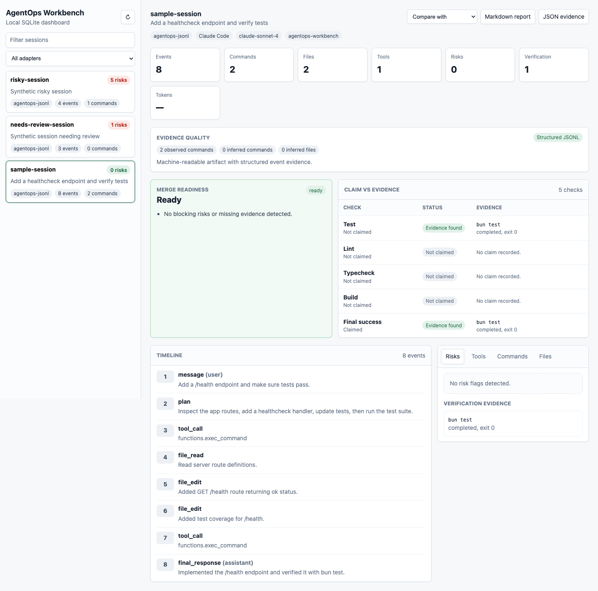
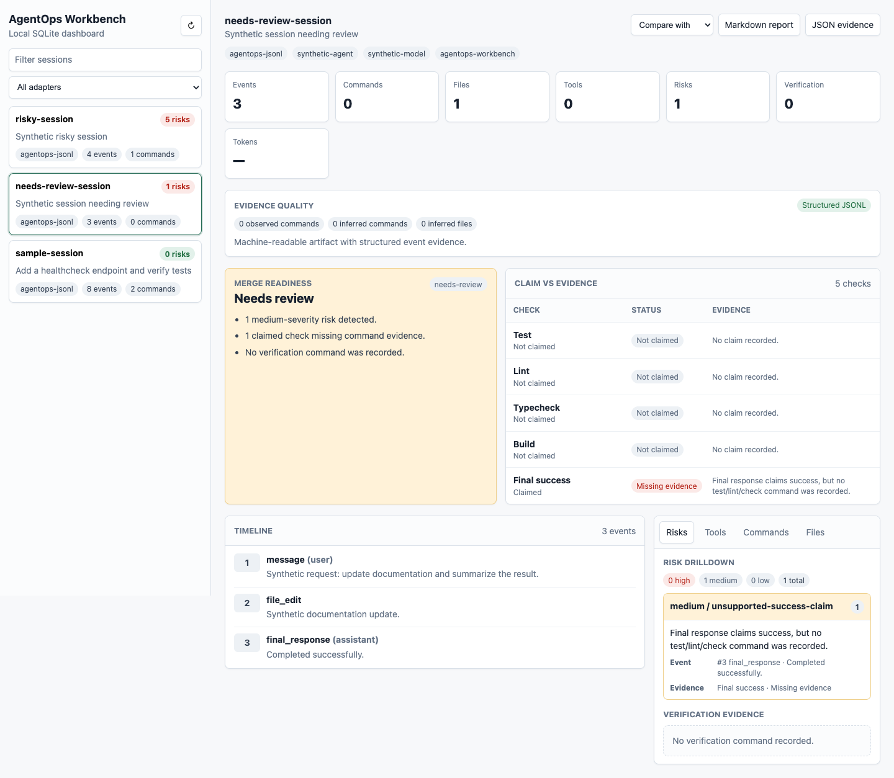
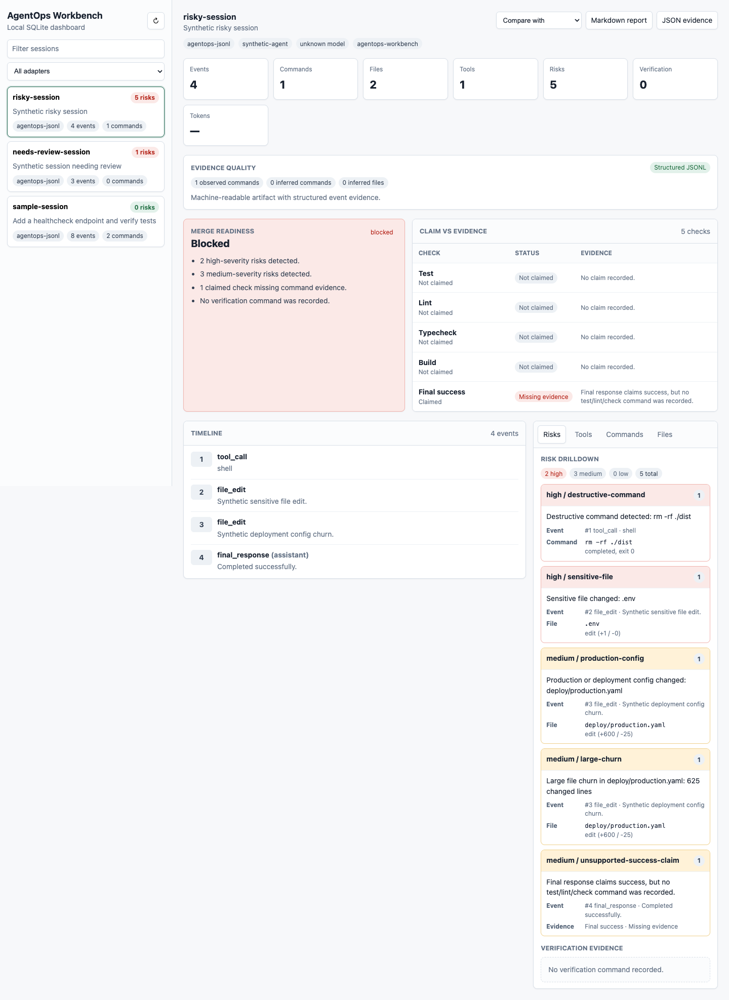

# AgentOps Workbench

[](https://github.com/DevenDucommun/agentops-workbench/actions/workflows/ci.yml)
[](https://github.com/DevenDucommun/agentops-workbench/releases)
[](LICENSE)

AgentOps Workbench is a local observability and audit tool for AI coding-agent runs. It helps teams understand what an agent did, what it changed, what evidence supports its final answer, and where the run created risk.

It is built for post-hoc review of Claude Code, Codex, PAI/KAI-style, and other coding-agent workflows through a shared JSONL event schema.

## Status

- Latest published release: [`v3.0.0`](https://github.com/DevenDucommun/agentops-workbench/releases/tag/v3.0.0) — product simplification: two ingest verbs (`run`/`audit`) and three save kinds (`report｜pr｜json`)
- Current `main`: tracks the latest release
- Capabilities: stable local review workflow with simplified product commands, guided first-run setup, first-class Codex and Claude Code capture commands, forensic plain-text import, deterministic quality gates for CI/PR workflows, read-only MCP session/report lookup, OpenInference-style JSON span export, decision-quality dashboard views, documented compatibility for schemas, adapters, CLI commands, config, reports, exports, migrations, privacy defaults, and release smoke coverage
- Runtime model: local CLI, local SQLite, stdout reports
- Distribution model: standalone self-contained binaries (macOS/Linux, arm64/x64) via the `curl | sh` installer or release download; source clone with Bun for development; npm publication still deferred
- Native Codex exec JSONL ingestion: implemented
- Native Claude Code stream JSON ingestion: implemented with synthetic fixture coverage

## Problem

AI coding agents can execute long, high-impact workflows across files, shell commands, MCP tools, tests, and external systems. The transcript usually contains the truth, but it is hard to inspect after the fact.

Engineering leaders need a compact answer to:

- What did the agent do?
- Which files and commands were involved?
- Did it run tests or only claim success?
- Did it touch risky paths or expose secrets?
- How long did it take and how much did it cost?
- Where did it retry, stall, or change direction?
- Is the output good enough to trust?

## Install

Download the standalone binary — no Bun, no clone, no PATH setup:

```bash
curl -fsSL https://raw.githubusercontent.com/DevenDucommun/agentops-workbench/main/install.sh | sh
agentops --help
```

The installer detects your OS/arch (macOS and Linux, arm64/x64), downloads the
matching binary from the [latest release](https://github.com/DevenDucommun/agentops-workbench/releases/latest),
and installs it to `/usr/local/bin` (override with `AGENTOPS_INSTALL_DIR`). You
can also grab a binary from the release page directly. The binary is
self-contained — the Bun runtime and SQLite are bundled in.

Then try it on synthetic fixtures:

```bash
agentops init
agentops demo
agentops look
agentops check
agentops open
```

## Run From Source (development)

Requirements: [Bun](https://bun.sh/) and Git.

```bash
git clone https://github.com/DevenDucommun/agentops-workbench.git
cd agentops-workbench
bun install
export PATH="$PWD/bin:$PATH"   # so you can type `agentops` instead of ./bin/agentops

agentops init
agentops demo
agentops look
agentops check
agentops save
agentops open
```

The `agentops` command is the repo's `bin/agentops` (a Bun script). The `PATH`
line above makes it available in the current shell; add it to your shell profile
to keep it. Without it, run the binary directly as `./bin/agentops <command>`.

For a no-surprises demo, inspect generated synthetic artifacts in
[docs/demo](docs/demo/README.md), or regenerate them locally:

```bash
bun run demo:artifacts
bun run smoke:demo-artifacts
```

For a new audited run:

```bash
agentops run codex "review the current diff"
agentops look
```

or:

```bash
agentops run claude "review the current diff"
agentops look
```

For after-the-fact review, import an existing machine-readable JSONL artifact:

```bash
agentops audit path/to/session.jsonl
```

To create an auditable artifact without the AgentOps wrapper, run the provider
in its machine-readable mode:

```bash
codex exec --json "review the current diff" > codex-session.jsonl
claude -p --output-format stream-json --verbose "review the current diff" > claude-session.jsonl
```

Plain terminal output and copied chat text can be imported for best-effort
forensic review:

```bash
agentops audit path/to/transcript.txt
```

Forensic text imports are lower-fidelity than provider JSONL. Reports label the
adapter as `forensic-text`, mark shell-prompt commands as `observed`, mark
narrative command/file mentions as `inferred`, and flag weak transcripts that
do not include observable commands.

## Dashboard Preview

The local dashboard reads from SQLite and surfaces a merge-readiness decision,
claim-vs-evidence checks, and a risk drilldown for each session. The synthetic
demo fixtures exercise three decision states:

**Ready** — verification evidence present, no blocking risks:



**Needs review** — at least one risk to look at before merging:



**Blocked** — high-severity risks or unsupported success claims:



Reproduce these states locally:

```bash
agentops audit ./fixtures/sample-session.jsonl
agentops audit ./fixtures/needs-review-session.jsonl
agentops audit ./fixtures/risky-session.jsonl
agentops open
```

Generate a repo-aware PR report:

```bash
agentops save pr
```

Expose local AgentOps evidence to MCP clients:

```bash
agentops mcp
```

Check public-readiness hygiene:

```bash
agentops scan-publication
```

Validate large synthetic-session performance:

```bash
bun run smoke:large-session
```

Validate tracked synthetic demo artifacts:

```bash
bun run smoke:demo-artifacts
```

## Installation

See [Install](#install) above for the standalone binary (recommended) and
[Run From Source](#run-from-source-development) for the Bun clone path. Full
details — PATH usage, `bun link`, release-archive caveats, and packaging — are in
[docs/INSTALLATION.md](docs/INSTALLATION.md).

## Current CLI

Regular workflow:

```bash
agentops init
agentops demo
agentops run codex "review the current change"
agentops run claude "review the current change"
agentops audit ./fixtures/sample-session.jsonl
agentops status
agentops look
agentops check
agentops save
agentops open
```

`agentops save` writes a local review bundle with default filenames:

- `agentops-report.md`
- `agentops-pr-comment.md`
- `agentops-gate.json`
- `agentops-session.json`

Specific saves are available when needed:

```bash
agentops save report
agentops save pr
agentops save json
agentops save json --repo
agentops save json --format openinference
agentops check --save
```

Advanced commands `adapters`, `config`, `sessions`, and `scan-publication`
remain available. There are two intents — launch a new run (`agentops run`,
with `--no-ingest` to write the artifact only) and review an existing artifact
(`agentops audit`, with `--quiet` to ingest only). The `v1.x`
`review｜report｜export｜gate｜repo-report｜pr｜inspect｜dashboard｜ingest｜show`
commands were removed in `v2.0.0`; `capture`/`import` and the
`save repo-json｜trace｜gate` kinds were folded into flags in `v3.0.0`. See
[CLI reference](docs/CLI.md) and [Compatibility policy](docs/COMPATIBILITY.md).

See [Compatibility policy](docs/COMPATIBILITY.md) for the stable `v3.0.0`
surfaces and experimental boundaries.

## MCP Server

`agentops mcp` starts a local stdio MCP server for read-only lookup of stored
sessions, inspection output, session reports, quality gates, and repo reports.
It does not ingest artifacts, run agents, post to GitHub, or read private
transcript stores.

See [MCP server](docs/MCP.md) for available tools and client configuration.

## Supported Artifacts

AgentOps currently ingests normalized post-hoc JSONL exports plus native Claude
Code and Codex CLI event streams:

- `agentops-jsonl`: canonical `agentops.event.v1` JSONL — any sanitized export
  (Claude Code, Codex, PAI/KAI, ...); provenance is preserved in each record's
  `source` field
- `claude-code-stream-json`: native `claude -p --output-format stream-json` JSONL stream
- `codex-exec-jsonl`: native `codex exec --json` JSONL stream
- `forensic-text`: best-effort plain terminal transcript or copied coding-agent text

`agentops run` launches Codex or Claude Code and ingests the result. Add
`--no-ingest` to write the native JSONL artifact without ingesting it:

```bash
agentops run codex "summarize the repo risk areas"
agentops run claude "review the current change"
agentops run codex "summarize the repo risk areas" --no-ingest
```

Raw captures are written under `.agentops/captures/` by default and should be
reviewed before publishing or turning into fixtures.

PAI-compatible post-hoc exports use the same canonical JSONL schema and are
auto-detected as `agentops-jsonl`:

```bash
agentops audit ./fixtures/pai-export-session.jsonl --quiet
agentops look
agentops save report
```

Synthetic Claude Code and Codex exports are the same canonical AgentOps JSONL,
distinguished only by their `source` field:

```bash
agentops audit ./fixtures/claude-code-session.jsonl --quiet
agentops audit ./fixtures/claude-code-stream-session.jsonl --quiet
agentops audit ./fixtures/codex-session.jsonl --quiet
agentops audit ./fixtures/codex-exec-session.jsonl --quiet
agentops adapters --input ./fixtures/codex-session.jsonl
```

The `claude-code-session` and `codex-session` fixtures are canonical
`agentops-jsonl` export examples (`source: claude-code` / `source: codex`). The
`codex-exec-session` fixture represents the native `codex exec --json` stream
shape with synthetic data.
The `claude-code-stream-json` fixture represents the native
`claude -p --output-format stream-json --verbose` stream shape with synthetic
data.

Forensic text import is intentionally narrower than transcript-store scraping:

```bash
agentops audit ./fixtures/forensic-terminal-transcript.txt
agentops audit ./fixtures/forensic-final-only.txt
agentops audit ./fixtures/forensic-codex-final-output.txt
agentops audit ./fixtures/forensic-claude-text-output.txt
```

Use it for saved terminal output or copied chat text when JSONL is unavailable.
It can infer commands, files, and final claims, but missing evidence remains
missing evidence. Raw Claude/Codex private transcript-file parsing remains out
of scope.

To inspect adapter detection:

```bash
agentops adapters --input ./fixtures/codex-session.jsonl
agentops adapters --input ./fixtures/claude-code-stream-session.jsonl
agentops adapters --input ./fixtures/codex-exec-session.jsonl
```

## Privacy And Safety

AgentOps is local-first by design:

- The default SQLite database lives at `.agentops/agentops.db`.
- `.agentops/`, `.agents/`, local databases, and env files are ignored by git.
- Raw payload storage is disabled by default.
- Raw payload hashes are stored by default.
- Redaction runs before storage by default.
- Public fixtures are synthetic.
- `agentops scan-publication` provides a baseline public-readiness check.
- Forensic imports may contain shell prompts, local paths, environment output,
  copied secrets, or account identifiers. Keep real transcripts under ignored
  local paths until redaction has been reviewed.

Override the database path when needed:

```bash
AGENTOPS_DB=/path/to/agentops.db agentops sessions
```

## Documentation

Current user-facing docs:

- [Installation](docs/INSTALLATION.md) (includes packaging strategy)
- [CLI reference](docs/CLI.md) (includes the repo report / `save pr`)
- [Capture guide](docs/CAPTURE_GUIDE.md)
- [Dashboard](docs/DASHBOARD.md)
- [MCP server](docs/MCP.md)
- [Quality gates](docs/QUALITY_GATES.md)
- [Exports](docs/EXPORT.md)
- [Configuration](docs/CONFIGURATION.md)
- [Demo artifacts](docs/demo/README.md)

Architecture and compatibility:

- [Architecture](docs/ARCHITECTURE.md)
- [Compatibility policy](docs/COMPATIBILITY.md)
- [Event schema](docs/EVENT_SCHEMA.md) (includes standards mapping)
- [Adapter strategy](docs/ADAPTER_STRATEGY.md) (includes the hook envelope shape)
- [Publication and privacy plan](docs/PUBLICATION_AND_PRIVACY.md)

Release docs:

- [Release checklist](docs/RELEASE_CHECKLIST.md) (includes the release flow)
- [Changelog](CHANGELOG.md)

Historical planning, research, and the Spec-Kit MVP artifacts live under
[docs/archive](docs/archive/): roadmaps, project brief, preliminary plan,
research landscape, native adapter research, PAI integration plan, design
decisions, pre-1.0 release records, and the Spec-Kit constitution/spec/plan/tasks.

## Example Report Sections

- Session summary
- Timeline of major actions
- Files touched
- Commands run
- Tests and verification evidence
- Risk flags
- Stalls/retries/loops
- Cost/token summary, when available
- Final outcome assessment

## Non-Goals For Current Releases

- Hosted SaaS
- Multi-user auth
- Full distributed-trace / OTLP-style waterfall UI (the local decision dashboard is a supported feature)
- Model benchmarking
- Deep semantic evals
- Direct modification of agent behavior
- Raw Claude Code transcript-file parsing

## Tech Direction

- TypeScript + Bun
- SQLite for local storage
- Markdown report output first
- Local decision dashboard as a supported first-class surface
- Adapter-based ingestion for Claude Code, KAI, and future runners

## Development

```bash
bun install --frozen-lockfile
bun run ci
```

To use the exact `agentops` command during local development, put the repo's `bin` directory on your path:

```bash
export PATH="$PWD/bin:$PATH"
agentops audit ./fixtures/sample-session.jsonl
agentops look
agentops check
agentops save
```
